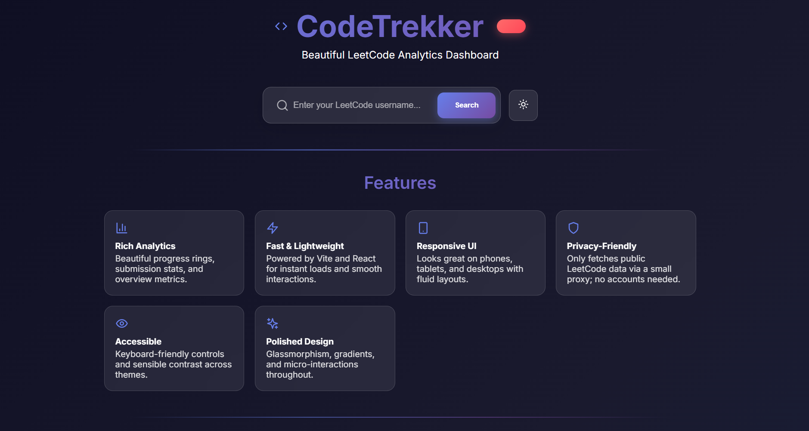
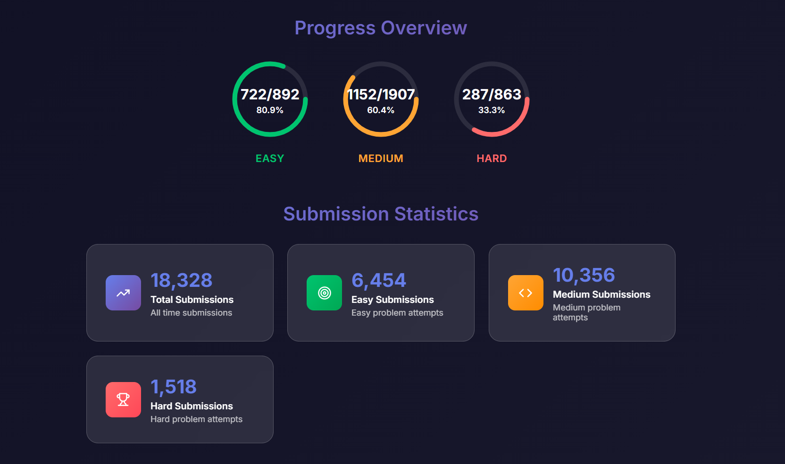
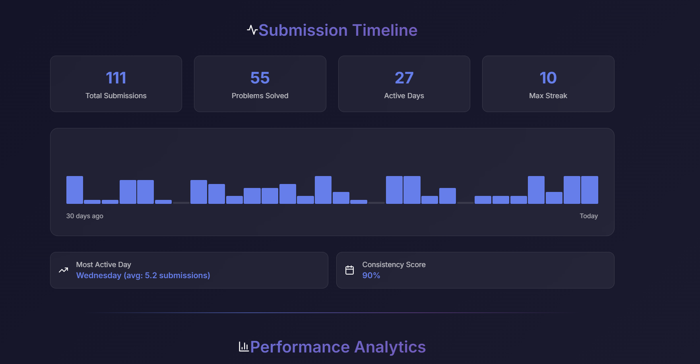
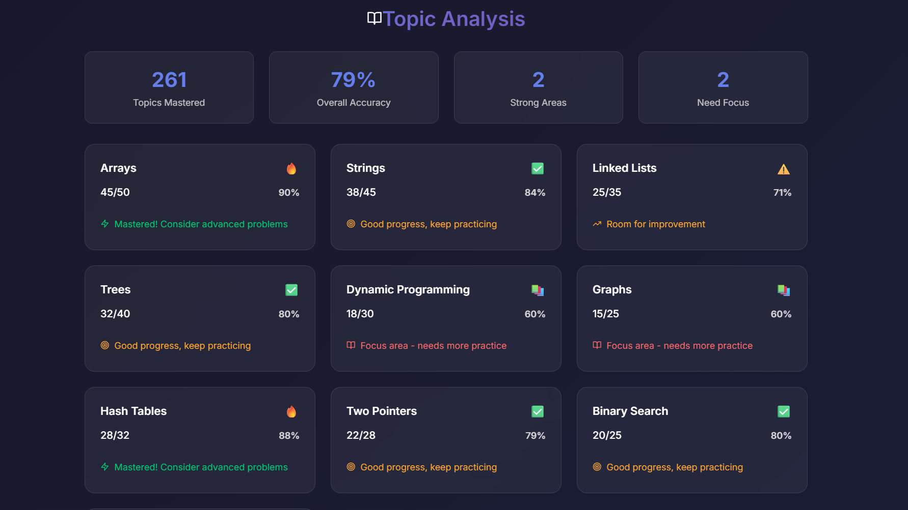

# CodeTrekker 🚀

A beautiful, modern web-based dashboard for analyzing your LeetCode performance and coding journey. Built with React, Vite, and modern web technologies to provide real-time insights into your problem-solving progress.


## 🖼️ Screenshots

### Main Dashboard & Features

*Beautiful dark-themed interface with search functionality and feature overview*

### Progress Overview & Analytics

*Visual progress rings showing Easy, Medium, and Hard problem completion rates*

### Submission Timeline & Performance

*Comprehensive submission tracking with daily activity and consistency metrics*

### Topic Analysis & Mastery

*Detailed breakdown of performance across different algorithm and data structure topics*

> **Note:** To display the screenshots properly, save your dashboard images in the `screenshots/` folder with the following names:
> - `main-dashboard.png` - Main interface and features
> - `progress-overview.png` - Progress rings and submission stats
> - `submission-timeline.png` - Timeline and performance metrics
> - `topic-analysis.png` - Topic mastery breakdown

## ✨ Features

- **📊 Real-time Analytics**: Get instant insights into your LeetCode performance
- **🎯 Progress Tracking**: Visual progress rings for Easy, Medium, and Hard problems
- **📈 Submission Statistics**: Detailed breakdown of your submission patterns
- **🌙 Dark/Light Theme**: Toggle between beautiful themes
- **📱 Responsive Design**: Works perfectly on all devices
- **⚡ Fast & Modern**: Built with Vite for lightning-fast development
- **🔍 Smart Search**: Auto-complete with recent searches
- **📊 Performance Metrics**: Comprehensive analysis of your coding journey

## 🚀 Live Demo

Visit [CodeTrekker](http://localhost:5173) to see it in action!

## 🛠️ Tech Stack

- **Frontend**: React 18, Vite, Framer Motion
- **Styling**: CSS3 with modern animations and gradients
- **Icons**: Lucide React
- **Backend**: Express.js proxy server
- **Data**: LeetCode GraphQL API integration

## 📦 Installation

### Prerequisites

- Node.js (v16 or higher)
- npm or yarn

### Quick Start

1. **Clone the repository**
   ```bash
   git clone https://github.com/yourusername/CodeTrekker.git
   cd CodeTrekker
   ```

2. **Install dependencies**
   ```bash
   npm install
   ```

3. **Start the development servers**
   ```bash
   # Terminal 1: Start the proxy server
   npm run server
   
   # Terminal 2: Start the frontend
   npm run dev
   ```

4. **Open your browser**
   Navigate to [http://localhost:5173](http://localhost:5173)

## 🎯 Usage

### Basic Search
1. Enter your LeetCode username in the search bar
2. Click "Search" or press Enter
3. View your comprehensive performance dashboard

### URL Parameters
You can also load results directly via URL:
```
http://localhost:5173/?u=yourusername
http://localhost:5173/?username=yourusername
```

### Features Overview
- **Overview Section**: Total problems solved and completion percentage
- **Progress Rings**: Visual representation of Easy/Medium/Hard progress
- **Submission Stats**: Detailed breakdown of all submissions
- **Performance Metrics**: Advanced analytics and insights
- **Topic Analysis**: Problem-solving patterns and strengths

## 🏗️ Project Structure

```
CodeTrekker/
├── src/
│   ├── components/          # React components
│   │   ├── AboutSection.jsx
│   │   ├── FeaturesSection.jsx
│   │   ├── ProgressRing.jsx
│   │   ├── StatsCard.jsx
│   │   └── ...             # More components
│   ├── App.jsx             # Main application component
│   ├── App.css             # Main styles
│   └── main.jsx            # Application entry point
├── proxy-server.js         # Express proxy server
├── vite.config.js          # Vite configuration
├── package.json            # Dependencies and scripts
└── README.md               # This file
```

## 🔧 Available Scripts

- `npm run dev` - Start development server
- `npm run build` - Build for production
- `npm run preview` - Preview production build
- `npm run server` - Start proxy server

## 🌐 API Integration

CodeTrekker integrates with LeetCode's GraphQL API through a secure proxy server:

- **Endpoint**: `/leetcode` (proxied to LeetCode GraphQL)
- **Authentication**: No authentication required
- **Rate Limiting**: Respects LeetCode's rate limits
- **CORS**: Handled by proxy server

## 🎨 Customization

### Themes
The app supports both dark and light themes. Users can toggle between them using the theme button.

### Styling
All styles are in CSS with CSS custom properties for easy theming:
- Color schemes
- Typography
- Spacing
- Animations

### Components
Each component is modular and can be easily customized or extended.

## 🚀 Deployment

### Build for Production
```bash
npm run build
```

### Deploy to Vercel/Netlify
1. Build the project: `npm run build`
2. Deploy the `dist` folder to your hosting platform
3. Ensure the proxy server is running or deployed separately

### Docker Deployment
```dockerfile
FROM node:18-alpine
WORKDIR /app
COPY package*.json ./
RUN npm ci --only=production
COPY . .
EXPOSE 3001
CMD ["node", "proxy-server.js"]
```

## 🤝 Contributing

We welcome contributions! Here's how you can help:

1. Fork the repository
2. Create a feature branch (`git checkout -b feature/AmazingFeature`)
3. Commit your changes (`git commit -m 'Add some AmazingFeature'`)
4. Push to the branch (`git push origin feature/AmazingFeature`)
5. Open a Pull Request

### Development Guidelines
- Follow React best practices
- Use meaningful component names
- Add proper TypeScript types (if converting)
- Test your changes thoroughly
- Update documentation as needed

## 📝 License

This project is licensed under the ISC License - see the [LICENSE](LICENSE) file for details.

## 🙏 Acknowledgments

- **LeetCode** for providing the GraphQL API
- **React Team** for the amazing framework
- **Vite Team** for the fast build tool
- **Framer Motion** for smooth animations
- **Lucide** for beautiful icons

## 📞 Support

If you encounter any issues or have questions:

1. Check the [Issues](https://github.com/yourusername/CodeTrekker/issues) page
2. Create a new issue with detailed information
3. Join our community discussions

## 🔮 Roadmap

- [ ] User authentication and profiles
- [ ] Advanced analytics and insights
- [ ] Problem recommendation system
- [ ] Social features and leaderboards
- [ ] Mobile app (React Native)
- [ ] API rate limiting and caching
- [ ] Export functionality (PDF/CSV)
- [ ] Integration with other coding platforms

---

**Made with ❤️ for the LeetCode community**

*Star this repository if you find it helpful!


